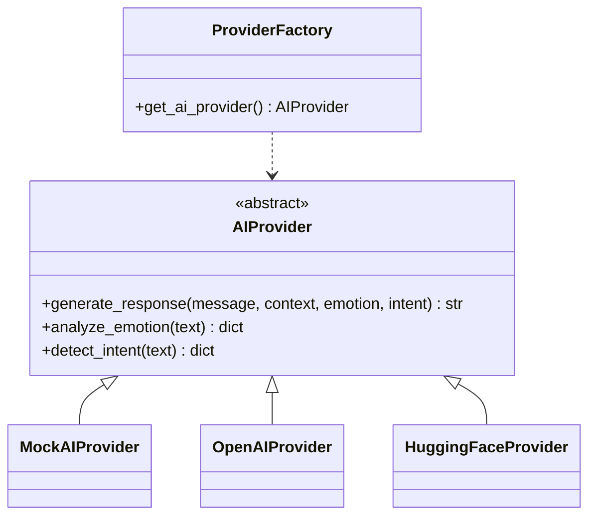

# MindEase AI — AI Architecture

## Provider Abstraction

The AI layer uses a provider abstraction so that the rest of the application does
not depend on any single vendor, and the app keeps working if an external provider
is unavailable.



`get_ai_provider()` reads `AI_PROVIDER` from settings:

- `mock` (default) → `MockAIProvider`
- `openai` → `OpenAIProvider` (uses an OpenAI-compatible chat completions HTTP API)
- `huggingface` → `HuggingFaceProvider` (HuggingFace Inference Endpoints)

If `AI_API_KEY` is missing for a remote provider, the factory falls back to the
**Mock provider** so the application never breaks.

## Mock Provider (Safe Demo Fallback)

The `MockAIProvider` is not a static script — it:

1. Detects emotion from weighted keyword scoring (joy, sadness, anxiety, anger,
   stress, panic, loneliness, neutral).
2. Detects intent from pattern rules (stress, anxiety, panic, crisis, medicine,
   wellness, journal…).
3. Selects a context-appropriate, empathetic response template per emotion/intent,
   drafted so it never diagnoses, prescribes, or makes clinical claims.
4. Appends one or more relevant suggested actions (e.g., breathing exercise,
   talk about what's bothering you, check mood).
5. Hands back a `suggested_actions` list so the UI can show real quick replies.

This makes the demo fully functional offline while the real provider path is
cleanly available with an API key.

## Emotion Analysis

`EmotionAnalyzer` uses weighted keyword and phrase dictionaries grouped per emotion.
It returns:

```json
{
  "emotion": "stress",
  "confidence": 0.97,
  "severity": "high",
  "matched_terms": ["stress", "stressed"]
}
```

The `severity` (low/medium/high) is derived from the strength and number of matched
terms. Emotion classification is **never** surfaced as a diagnosis — the UI frames
results as "recent conversations show stress-related language" only.

## Intent Detection

`IntentDetector` matches regex patterns against the message and scores hits. Intents:

| Intent | Example trigger |
|--------|-----------------|
| general | "hi, what can you do" |
| emotional_support | "I need someone to talk to" |
| stress | "feeling overwhelmed at work" |
| anxiety | "so anxious about the future" |
| panic | "having a panic attack" |
| sadness | "I feel really low" |
| anger | "this makes me furious" |
| loneliness | "I feel so alone" |
| academic_pressure | "so stressed about my exams" |
| sleep | "trouble sleeping again" |
| wellness_exercise | "give me a breathing exercise" |
| mood_tracking | "I want to log my mood" |
| journal | "I want to write a journal entry" |
| medicine_info | "tell me about fluoxetine" |
| medical_care | "should I see a doctor" |
| professional_help | "find me a therapist" |
| crisis | "I want to hurt myself" |

## Context & Memory

- The pipeline passes only the **last 10 messages** of the current conversation to
  the provider (not entire history).
- Deleted conversations are removed from the database and are never used as context.
- No cross-conversation or cross-user history is sent to the model.