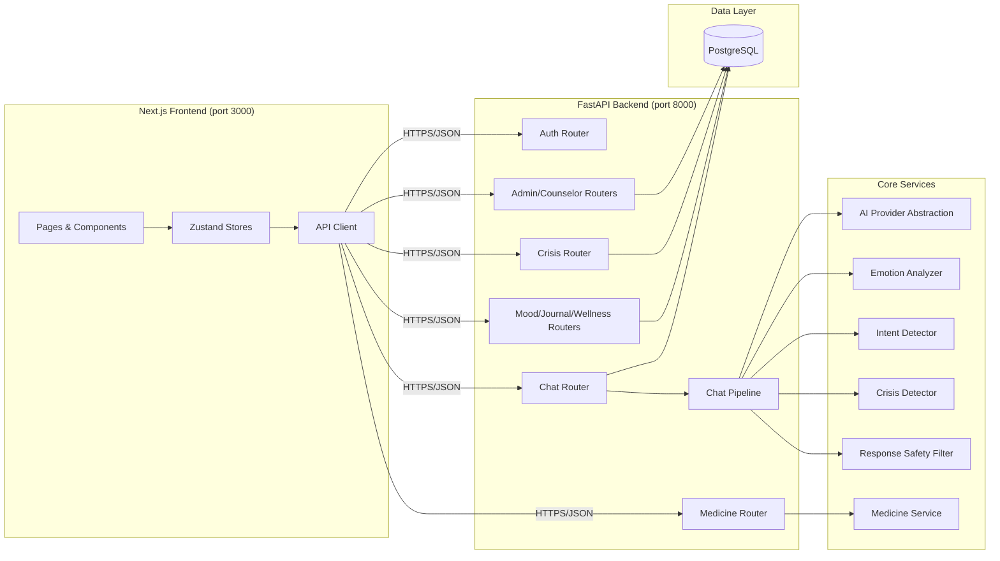
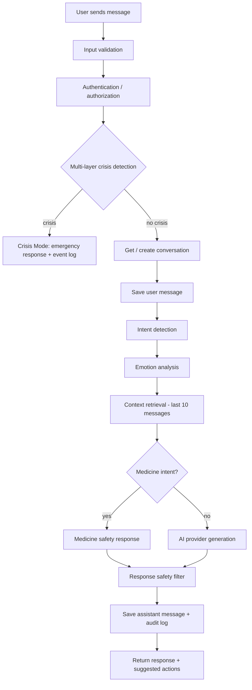
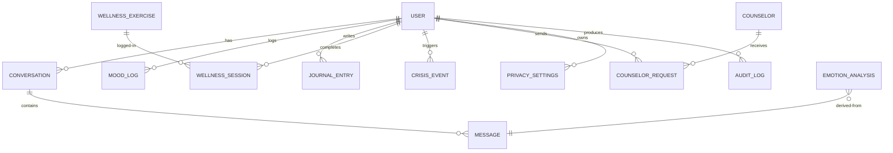

# MindEase AI — System Architecture

## Overview

MindEase AI is a full-stack, privacy-first mental-wellness platform. It separates
UI, business logic, API, AI/NLP, safety, authentication, and data layers cleanly
between a Next.js frontend and a FastAPI backend backed by PostgreSQL.

## Chat Message Pipeline

Every chat message flows through the following pipeline in strict order:

Crisis detection has priority over normal generation and short-circuits the pipeline.

## Data Model (ER)

Key entities: `users`, `conversations`, `messages`, `mood_logs`, `journal_entries`,
`emotion_analysis`, `wellness_exercises`, `wellness_sessions`, `medicine_information`,
`emergency_resources`, `counselors`, `counselor_requests`, `crisis_events`,
`audit_logs`, `user_privacy_settings`.

Uses UUID primary keys, foreign keys with `ON DELETE CASCADE`, indexes on
frequently queried columns, and `created_at` / `updated_at` timestamps.

## Roles & Authorization

- **USER** — owns their conversations, journal, moods, and wellness sessions; can send counselor requests.
- **COUNSELOR — sees only requests/sessions routed to them and data the user has consented to share.
- **ADMIN — manages users, counselors, medicines, emergency resources, wellness content, crisis rules, and audit logs.

## Frontend Architecture

- Next.js App Router with route groups: `(auth)`, `(main)`.
- Zustand stores for auth, chat, mood, and theme with localStorage persistence.
- A single API client (`src/lib/api.ts`) wraps all backend routes with JWT auth headers.
- Design system built from reusable UI primitives (button, card, modal, slider…)
  plus shared components (AI orb, emotion badge, typing indicator, empty states).
- Framer Motion for animations; Recharts for charts; dark/light theme via a CSS-variable toggling store.