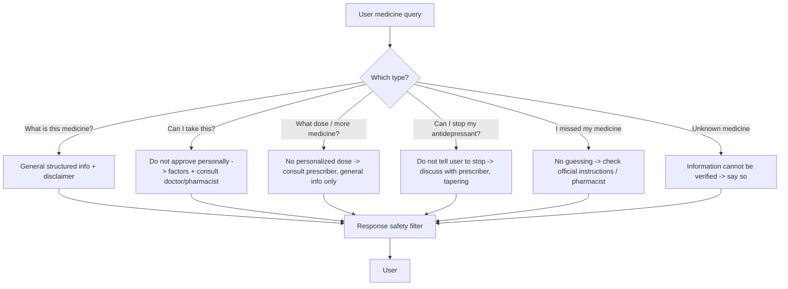

# MindEase AI — Medicine Safety Architecture

## Principle

MindEase AI is **not** a pharmacist or prescriber. Medicine content is:

- **source-based** from a structured, trusted database (seeded records carry
  `source`, `source_url`, `last_updated`);
- **not invented** by the LLM — if a medicine can't be reliably identified, the
  system says so instead of guessing;
- always shown with a clearly visible disclaimer:
  > **General information only — not a prescription or personalized medical advice.**

## Query Handling Rules

### General Information
When the user simply asks "what is this medicine?", the system returns structured
educational facts from the record (name, generic name, category, common uses,
common side effects, warnings, precautions, general administration notes) with a
disclaimer and source attribution.

### "Can I take this medicine?"
Do **not** approve personally. Reply that suitability depends on medical history,
other medications, allergies, etc., and advise consulting a doctor/pharmacist.

### "What dose should I take?" / "Can I take more?"
Do **not** provide personalized dosing. If reliable general educational dosage
information exists, clearly distinguish it from personal instructions and direct
the user to their prescription/healthcare professional.

### "Can I stop my antidepressant?"
Do **not** instruct the user to stop. Advise discussing medication changes with
their prescriber/pharmacist; mention that stopping suddenly can cause withdrawal.

### "I missed my medicine"
Do **not** guess. Advise checking the medicine's official instructions or
contacting a pharmacist/prescriber — especially since the specific medicine may
be unknown.

## Data Model

`medicine_information` stores: `name`, `generic_name`, `category`, `common_uses`,
`description`, `side_effects`, `warnings`, `precautions`, `administration_info`,
`interaction_warnings`, plus `source`, `source_url`, `last_updated`, `is_active`.

## Pipeline Integration (Chat)

1. `IntentDetector` routes a medicine-related message to `medicine_info`.
2. `MedicineService.get_medicine_by_name()` searches the structured DB.
3. `MedicineService.get_safe_medicine_response()` builds a safe, disclaimed reply
   per the rules above (no LLM invention).
4. The response still passes the `ResponseSafetyFilter` as a final guard.

## Admin Control

ADMIN can add/edit/deactivate medicine records, keeping `source`, `source_url`,
and `last_updated` accurate. Records without reliable sourcing should not be
activated in production.