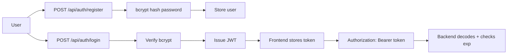

# MindEase AI — Security Architecture

## Authentication

- Passwords hashed with **bcrypt** via Passlib (never stored in plaintext; salts are unique per password).
- Sessions use **JWT** (HS256). Tokens carry `sub` (user id) and `exp` (expiry).
- Protected routes use the `get_current_user` / `get_current_active_user` FastAPI dependencies.
- Register/Login/Logout endpoints; logout revokes sessions.

## Authorization (RBAC)

Roles: `user`, `counselor`, `admin`.

- Ownership checks ensure users only access **their own** data (conversations,
  journal, moods, sessions).
- Counselor routes restrict access to counselor-authorised data (consented data only).
- Admin routes require `role == "admin"`.

## Input Validation & Hardening

- **Pydantic schemas** validate every request body; invalid input returns `4xx`.
- **SQL injection protection** — SQLAlchemy parameterized queries throughout.
- **XSS protection** — React escapes rendered data; response safety filters apply to AI output.
- **Rate limiting hooks** — Redis-backed rate limiting can be enabled; abstraction in place.
- **CORS** — configured via `CORS_ORIGINS`; only the frontend origin is allowed.
- **Secure headers** — production deployment should apply security headers (e.g., via reverse proxy or middleware).
- **CSRF** — for token-based auth, API tokens are sent in Authorization headers (not cookies), which is CSRF-safe.

## Secrets

- All secrets come from environment variables (`.env`), never committed.
- `JWT_SECRET` and `ENCRYPTION_KEY` must be set to strong random values in production.
- The frontend `NEXT_PUBLIC_*` vars contain **no secrets** — the API key stays server-side only.

## Logging & Audit

- `audit_logs` table records key actions (chat messages with intent/emotion metadata
  — **not full raw sensitive content**, and never passwords/tokens).
- No password, API key, or token values are ever logged.

## Data Protection

- `user_privacy_settings` gives users control over sharing, analytics, and retention.
- Data export endpoint; account deletion removes user-owned data (cascade).
- Sensitive chat, journal, and mood data are stored in the DB with access gated by
  ownership checks.

## Threat Model Notes

| Threat | Mitigation |
|--------|-----------|
| Account takeover | bcrypt password hashing, JWT expiry |
| Privilege escalation | role checks on admin/counselor routes, ownership checks |
| Injection | SQLAlchemy bind params, Pydantic validation |
| Data breach | minimize sensitive collection; encryption key for at-rest data |
| Prompt injection / unsafe AI output | layered crisis detection + response safety filter |
| Misinformation | medicine info is source-based; never LLM-invented |